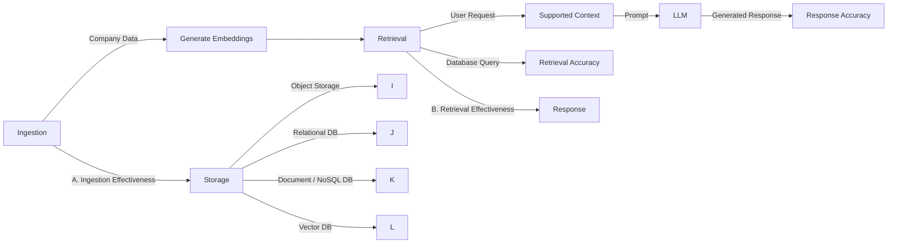

# Setup 

Create kind cluster 

```
kind create cluster --name ml-in-production-course-week-2
```

Run k9s 

```
k9s -A
```


# MINIO 

Based on https://github.com/kubernetes/examples/tree/master/staging/storage/minio

Deploy 

```
kubectl create -f minio-standalone-dev.yaml
```


Access UI and API 

```
kubectl port-forward --address=0.0.0.0 pod/minio 9000 9090

```

# S3 access 


```
export AWS_ACCESS_KEY_ID="minio"
export AWS_SECRET_ACCESS_KEY="minio123"
export AWS_ENDPOINT="http://0.0.0.0:9000"

aws s3 ls --endpoint-url $AWS_ENDPOINT
aws s3api create-bucket --bucket test --endpoint-url $AWS_ENDPOINT 
```


# MINIO Client 


```
pytest test_minio_client.py
```

- https://docs.min.io/docs/python-client-api-reference.html
- https://boto3.amazonaws.com/v1/documentation/api/latest/reference/services/s3.html
- https://s3fs.readthedocs.io/en/latest/


# CVS inference 

```
python inference_example.py run-single-worker --inference-size 10000000
python inference_example.py run-pool --inference-size 10000000
python inference_example.py run-ray --inference-size 10000000
python inference_example.py run-dask --inference-size 10000000
```

# Pandas profiling 

https://aaltoscicomp.github.io/python-for-scicomp/data-formats/


# Pormising new format: Lance

- https://github.com/lancedb/lance
- [An Empirical Evaluation of Columnar Storage Formats](https://arxiv.org/abs/2304.05028)


# Streaming dataset

- https://www.tensorflow.org/tutorials/load_data/tfrecord
- https://github.com/aws/amazon-s3-plugin-for-pytorch
- https://pytorch.org/blog/efficient-pytorch-io-library-for-large-datasets-many-files-many-gpus/
- https://github.com/webdataset/webdataset
- https://github.com/mosaicml/streaming


Create
```
python tutorial.py create-data --path-to-save random-data
```

Upload

```
aws s3api create-bucket --bucket datasets --endpoint-url $AWS_ENDPOINT
aws s3 cp --recursive random-data s3://datasets/random-data --endpoint-url $AWS_ENDPOINT
```

Read

```
python tutorial.py get-dataloader --path-to-save random-data
```


# DVC 


Init DVC

```
dvc init --subdir
git status
git commit -m "Initialize DVC"
```

Add data 

```
mkdir data
touch ./data/big-data.csv
```

Add to dvc

```
dvc add ./data/big-data.csv
git add data/.gitignore data/big-data.csv.dvc
git commit -m "Add raw data"
```

Add remote 

```
aws s3api create-bucket --bucket ml-data --endpoint-url $AWS_ENDPOINT

dvc remote add -d minio s3://ml-data
dvc remote modify minio endpointurl $AWS_ENDPOINT
```

Save code to git 

```
git add .dvc/config
git commit -m "Configure remote storage"
git push 
```

Save data to storage

```
export AWS_ACCESS_KEY_ID=minioadmin
export AWS_SECRET_ACCESS_KEY=minioadmin
dvc push
```

- https://dvc.org/doc/start/data-management
- https://github.com/iterative/dataset-registry


# LakeFS 

Generate template 

```
helm template my-lakefs lakefs/lakefs > lakefs-deploy.yaml
```

Deploy lakefs on k8s 

```
kubectl create -f lakefs-deploy.yaml
```
** Note: it might take ~10 min to deploy it 


Access lakefs 

```
kubectl port-forward svc/my-lakefs 5000:80
```


- https://lakefs.io/
- https://docs.lakefs.io/integrations/python.html
- https://docs.lakefs.io/integrations/kubeflow.html


# Labeling: Label-studio and RLHF

```
docker run -it -p 8080:8080 -v `pwd`/mydata:/label-studio/data heartexlabs/label-studio:latest
```

```
python generate_mock_rlhf_dataset.py
```

Reference:

- https://labelstud.io/blog/create-a-high-quality-rlhf-dataset/
- https://github.com/HumanSignal/RLHF
- https://github.com/huggingface/trl
- https://huggingface.co/google/flan-t5-base
- https://docs.argilla.io/en/latest/tutorials_and_integrations/tutorials/feedback/train-reward-model-rlhf.html


# RAG

## Vectors

https://github.com/huggingface/text-embeddings-inference

## Vector DBs

https://llm-stack-rag.streamlit.app/

- https://github.com/erikbern/ann-benchmarks
- https://github.com/harsha-simhadri/big-ann-benchmarks
- https://qdrant.tech/benchmarks/


## QDrant example

https://github.com/qdrant/qdrant

## Milvus example


Deploy with Helm 


```
kubectl apply -f https://github.com/jetstack/cert-manager/releases/download/v1.5.3/cert-manager.yaml
helm repo add milvus https://milvus-io.github.io/milvus-helm/
helm repo update
helm upgrade --install vector-search --set cluster.enabled=false --set etcd.replicaCount=1 --set pulsar.enabled=false --set minio.mode=standalone milvus/milvus
```

Deploy with kubeclt


```
kubectl apply -f https://github.com/jetstack/cert-manager/releases/download/v1.5.3/cert-manager.yaml
helm repo add milvus https://milvus-io.github.io/milvus-helm/
helm repo update
helm template --set cluster.enabled=false --set etcd.replicaCount=1 --set pulsar.enabled=false --set minio.mode=standalone milvus/milvus > milvus.yaml
kubeclt create -f milvus.yaml
```

Run UI 


```
kubectl port-forward svc/my-vector-db-milvus --address=0.0.0.0 19530:19530
docker run -p 8000:3000 -e MILVUS_URL=0.0.0.0:19530 zilliz/attu:v2.2.3
```

## RAG pattern

# A RAG system can be evaluated with different goals in mind

## Domain Agnostic Evaluation
In this approach, our primary objective of evaluation is to assess the speed and efficiency of the RAG system from a technical perspective. In this case, the evaluation isn't dependent on the domain or specific content of the datasets/vectors and the two areas of assessment are as follows:

- **Ingestion Effectiveness**: how fast and cost effective is the system in terms of ingesting the relevant data?
- **Retrieval Effectiveness**: how fast and cost effective is the system at retrieving results given the user request?

## Domain Specific Evaluation
Alternatively evaluation may focus on the quality of what the system produces, this is not in the scope of our work at this time.

- **Retrieval Accuracy**: how well does the system retrieve the right information from the database given the request?
- **Response Accuracy**: how well does the system generate a response, given the user request?

### Mermaid Diagram



## End2end example

https://github.com/truskovskiyk/surrealdb-docs-retrieval

## RAG Labeling: Argilla

```
docker run -d --name argilla -p 6900:6900 argilla/argilla-quickstart:latest
```


https://docs.argilla.io/en/latest/tutorials_and_integrations/tutorials/feedback/fine-tuning-openai-rag-feedback.html


## RAG Eval: LLM as a judge

